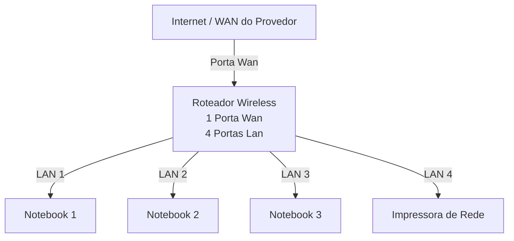

# laboratorio redes 01 - Projeto de Rede Local
Aluno: Felippe Camargo  
Professor: José de Assis  
Data: 09/03/26

---

## 1. Objetivo
Implementar uma rede Local slimples conectando 3 notebooks a um roteador wireless com switch e uma impressora de rede

O Projeto será divido em duas etapas

1. Simulação da Rede no Cisco Packet Tracer
2. Implementação da rede no laboratorio Real

---

## 2. Equipamentos utilizados neste Laboratorio

- 3 Notebooks
- 1 Roteador Wireless com uma porta Wan e 4 portas Lan
- 1 Impressora de Rede
- Cabos de Rede

---

## 3. Topologia da Rede

Diagrama Logico da Rede Usada nesteb Laboratorio

---

## Imagem da Topologia usada neste Laboratorio:
  

---
